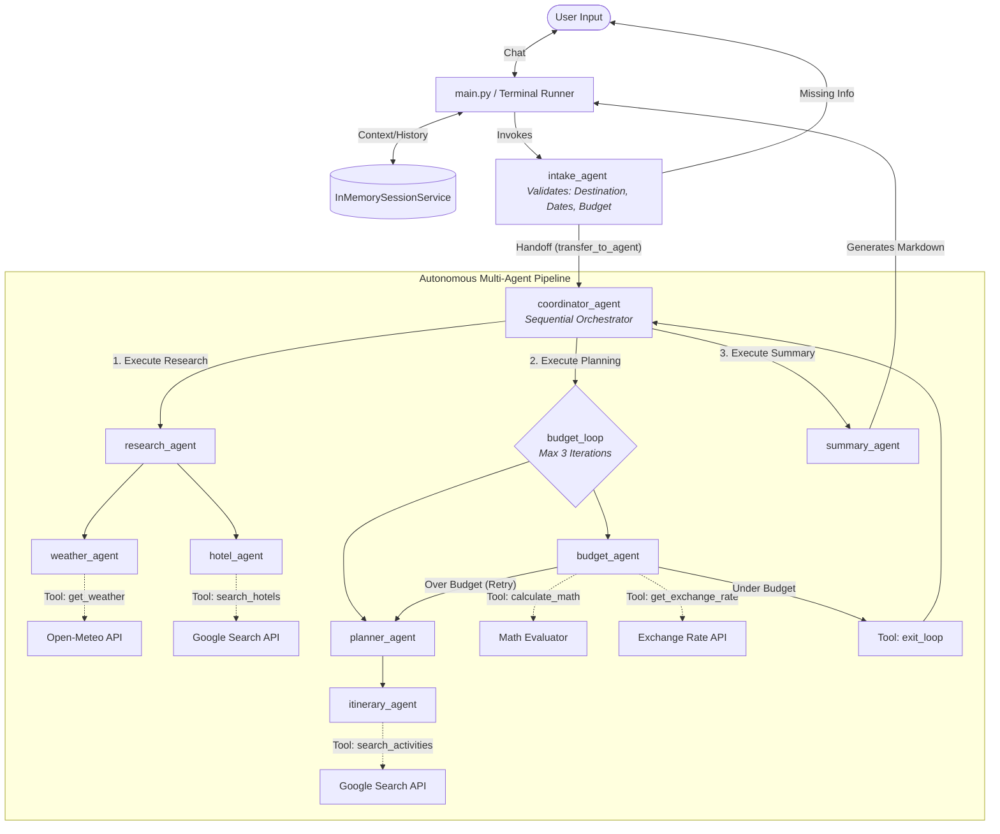

# Architecture Overview

This document provides a holistic overview of the Travel Agent Multi-Agent System (MAS). It visually maps the entire journey of a user's request—from the terminal input to the final markdown itinerary—demonstrating how memory, orchestration, delegation, and tools all interact in a single cohesive system.

---

## The Complete System Flowchart

The following diagram illustrates the complete, end-to-end architecture of the application.

---

## How It Works (Step-by-Step Explanation)

### 1. Interface and Memory
- **`main.py` & `InMemorySessionService`**: The user interacts with the system via the terminal. Every single prompt, tool call, and agent response is recorded in the `InMemorySessionService`. This shared memory means that downstream agents (like the `summary_agent`) inherently know what upstream agents (like the `hotel_agent`) discovered, without needing direct data passing.

### 2. Conversational Gating (The Intake Agent)
- **`intake_agent`**: The runner always starts here. This agent acts as a strict conversational gatekeeper. If the user says, *"Plan a trip to London,"* the agent sees that Dates and Budget are missing and will ask for them. It will **not** trigger the heavy processing pipeline until all criteria are met. Once satisfied, it uses the `transfer_to_agent` tool to hand control to the orchestrator.

### 3. Orchestration (The Coordinator Agent)
- **`coordinator_agent`**: This is a `SequentialAgent`. It does not think for itself; rather, it enforces strict software execution order. It guarantees that Research happens first, Planning happens second, and Summarization happens last.

### 4. Delegation (Sub-Agents)
- **`research_agent` & `planner_agent`**: These act as "Managers." Instead of searching for hotels and weather themselves (which would bloat their prompts and confuse the LLM), they delegate narrow tasks to specialized "Sub-Agents" (like `weather_agent` and `itinerary_agent`). 

### 5. Tool Execution
- **Tools**: When an agent (like the `weather_agent`) needs live data, it outputs a JSON function call instead of text. The ADK framework intercepts this, runs the Python function (`get_weather`), and injects the real-world API data back into the agent's context window.

### 6. Iterative Self-Correction (The Budget Loop)
- **`budget_loop`**: This is a `LoopAgent` that wraps the planning and budget verification phases. If the `budget_agent` does the math and realizes the itinerary is too expensive, it provides feedback and the loop routes back to the `planner_agent` to pick cheaper options. Only when the budget is satisfied does the agent trigger the `exit_loop` tool, allowing the coordinator to finally move to the summary phase. 
