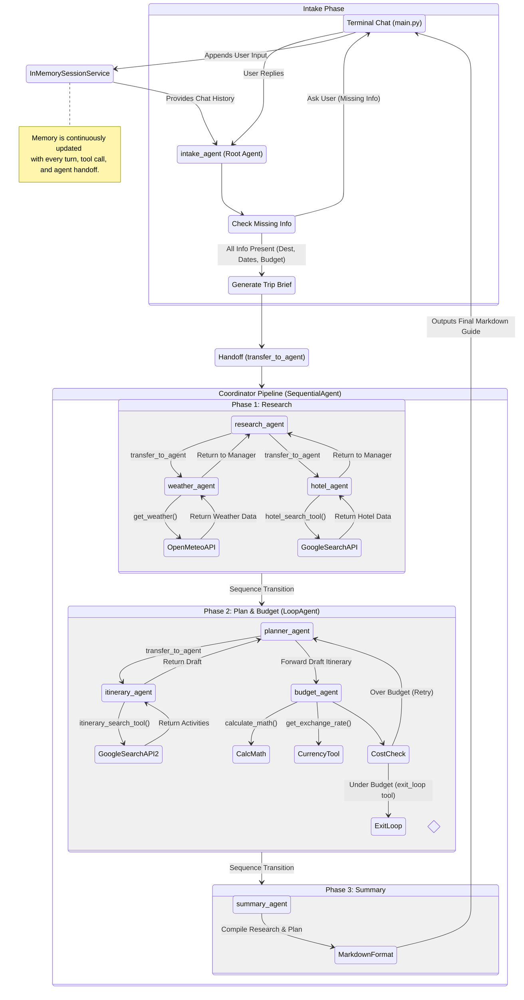

# Architecture Overview

This document provides a holistic overview of the Travel Agent Multi-Agent System (MAS) architecture. It traces the complete execution flow from the moment a user inputs a prompt, through the specialized agent hierarchy, down to the tools used, and finally to the generated itinerary output.

---

## Comprehensive Execution Flowchart

The following diagram illustrates the complete end-to-end lifecycle of a user's request. It combines the user interface, session memory, orchestrators, sub-agents, and external tool integrations into a single flow.

---

## Detailed Stage Explanations

The multi-agent system execution is broken down into distinct, specialized stages:

### 1. Initialization and Context (UI & Memory)
- **Terminal Chat (`main.py`)**: The entry point where the user interacts with the system. It binds the root agent to the ADK `Runner`.
- **`InMemorySessionService`**: A continuous ledger. Every interaction—user prompts, LLM responses, tool executions, and agent handoffs—is appended here. When any agent wakes up to act, it reads this entire ledger to understand the current context (e.g., the `summary_agent` can look back at the `hotel_agent`'s data without it being explicitly passed).

### 2. The Intake Phase (Conversational Gating)
- **`intake_agent`**: The root agent that acts as a friendly gatekeeper. Instead of attempting to plan a trip with missing data, it holds a conversational loop with the user until it has confirmed three mandatory pieces of information: Destination, Travel Dates, and Budget.
- **Handoff**: Once the data is secured, it generates a standardized "Trip Brief" and uses the `transfer_to_agent` tool to hand control over to the automated pipeline.

### 3. The Coordinator Pipeline (Deterministic Orchestration)
- **`coordinator_agent`**: A `SequentialAgent` that forces the execution of tasks in a strict, linear order. This prevents the LLM from hallucinating costs before researching, or summarizing before planning.

### 4. Phase 1: Research (Delegation)
- **`research_agent`**: Acts as a manager. It does not perform lookups itself. Instead, it delegates tasks horizontally to specialized sub-agents.
- **`weather_agent`**: A sub-agent that uses the `get_weather` tool (calling the Open-Meteo API) to fetch real-time forecasts.
- **`hotel_agent`**: A sub-agent that uses a unique Google Search tool to find live hotel availability and pricing.

### 5. Phase 2: Plan & Budget (Self-Correction Loop)
- **`budget_loop`**: A `LoopAgent` that wraps the planning and budgeting agents. It acts as an autonomous retry mechanism.
- **`planner_agent`**: Drafts the day-by-day itinerary, delegating activity lookups to the `itinerary_agent` (which uses its own Google Search tool).
- **`budget_agent`**: Takes the drafted itinerary and acts as an accountant. It uses `calculate_math` and `currency_tool` to sum the total estimated costs. 
  - *If over budget:* It refuses to exit the loop and sends feedback back to the `planner_agent` to find cheaper options.
  - *If under budget:* It calls the `exit_loop` tool, allowing the sequence to proceed.

### 6. Phase 3: Summary (Final Output)
- **`summary_agent`**: The final node in the sequence. It reads the entire session memory, extracts the finalized itinerary and research data, and formats a beautiful, cohesive Markdown travel guide to present back to the user on the Terminal.
