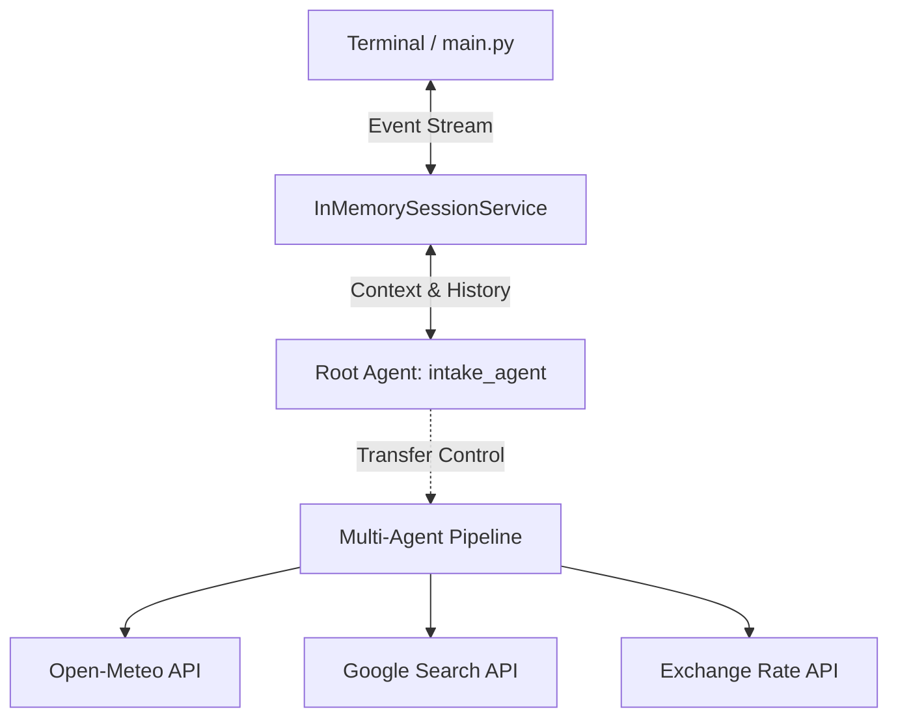
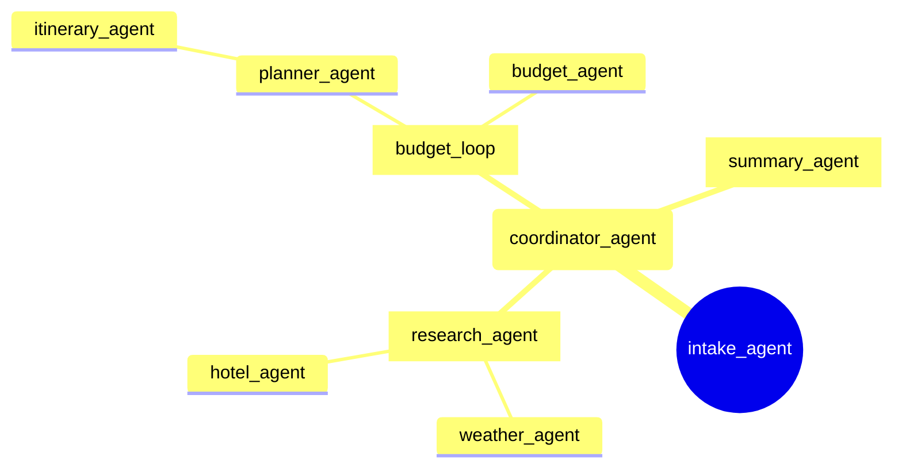
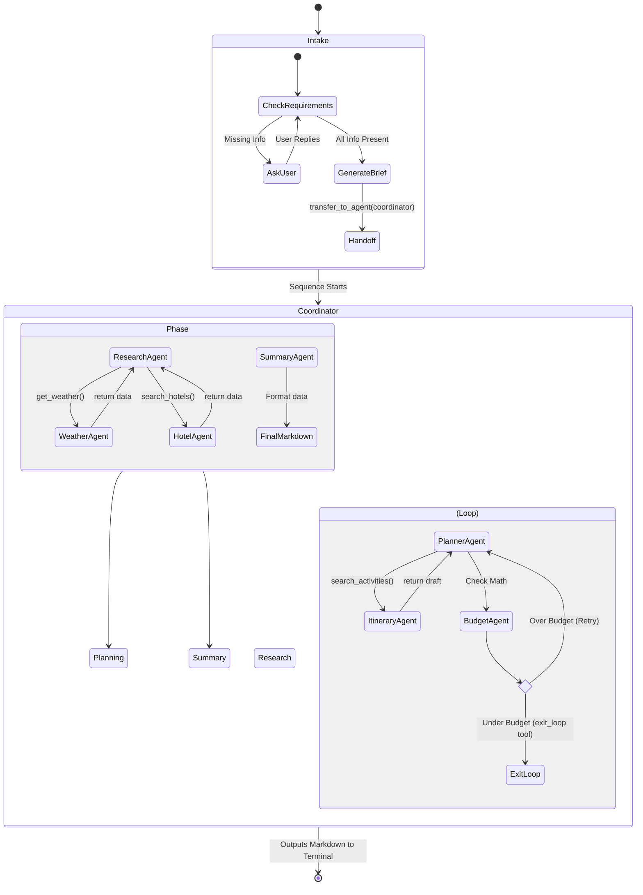
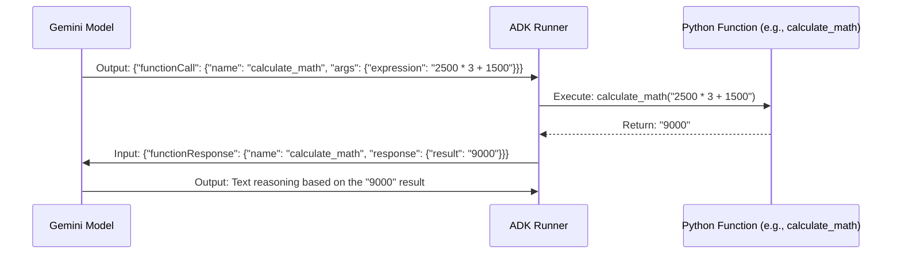

# Architecture Overview

This document provides a holistic, visual overview of the Travel Agent Multi-Agent System (MAS) architecture, detailing how requests flow from the user through the agent hierarchy, how tools are integrated, and how session memory is maintained.

---

## 1. High-Level System Architecture

At the highest level, the system consists of a User Interface (the Terminal Runner), a Session Memory layer, and the core Agent Hierarchy.

---

## 2. Agent Hierarchy & Delegation Tree

The agents are organized hierarchically. An orchestrator delegates to sub-agents, which can delegate to specific tool-using nodes.

---

## 3. End-to-End Request Lifecycle

This flowchart illustrates exactly what happens when a user types "I want to go to Chennai for 3 days with a 12k budget."

---

## 4. Tool Integration Flow

Agents don't execute Python code directly. They output a JSON representation of a function call, which the ADK framework intercepts, executes, and returns to the agent.

---

## 5. Session and Memory Flow

The `InMemorySessionService` acts as a continuous ledger. Every interaction (User Prompt, LLM Response, Tool Call, Tool Result, Agent Transfer) is appended to a massive array of events. When an agent wakes up to act, it reads this entire ledger to understand the current context.

* **Advantage:** If the `summary_agent` runs at the very end of the pipeline, it can effortlessly look back at the `hotel_agent`'s tool response from the very beginning of the pipeline without needing data explicitly passed to it via arguments.
* **Limitation:** As the sequence grows, the context window fills up, which is why models like `gemini-2.0-flash` with massive context windows (1M+ tokens) are required for complex Multi-Agent Systems.
