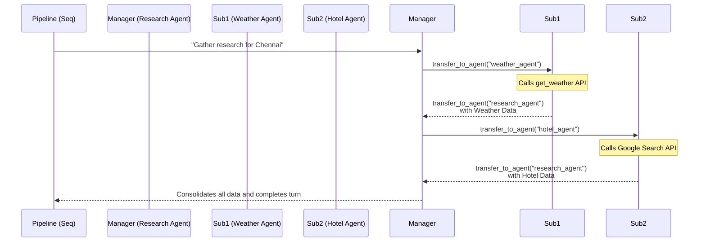

# Phase 4: Sub-Agents & Delegation

## 1. Phase Overview
As tasks become more complex, a single agent (even with tools) gets overwhelmed by trying to hold too many instructions and tools at once. In this phase, we introduce **Delegation**. 
In our project, the `research_agent` acts as a "Manager." It doesn't actually search the web itself; instead, it delegates weather research to the `weather_agent` and hotel research to the `hotel_agent`.

**Why this phase is important:** It enables horizontal scaling of intelligence. By breaking massive tasks into specialized micro-agents, we reduce prompt size, lower the risk of LLM confusion, and improve accuracy.

---

## 2. Concepts Learned
- **Sub-Agents:** Autonomous agents nested under a parent agent, specialized for a very narrow task.
- **Transfer to Agent (Handoff):** The mechanism by which a manager pauses its own execution, gives a command to a sub-agent, and waits for that sub-agent to return a result.
- **Agent Registry:** How the underlying system tracks agent names to ensure control is passed to the correct entity.

---

## 3. Implementation Details
In `agents/research_agent.py`, the agent is configured with `sub_agents=[weather_agent, hotel_agent]`.
- Because these sub-agents are registered, the ADK automatically injects a `transfer_to_agent` tool into the `research_agent`'s toolbelt.
- The `research_agent`'s instruction explicitly tells it to call `transfer_to_agent(weather_agent)` first, then wait for the response, then call `transfer_to_agent(hotel_agent)`. 
- The sub-agents also use the `transfer_to_agent` tool to hand control *back* to the `research_agent` when they are finished.

---

## 4. Architecture Diagram

---

## 5. Why This Concept Is Needed
**The Problem Solved:** If one agent has 15 tools (weather, search, math, database, email), the LLM struggles to select the right tool at the right time. The prompt becomes massive and expensive.
**Benefits Introduced:** Separation of concerns. The `hotel_agent` only needs instructions about hotels and the search tool. The `weather_agent` only needs the weather tool. This makes the system modular, easier to debug, and cheaper to run.

---

## 6. With vs Without This Concept

| Without Sub-Agents (Monolith) | With Sub-Agents (Delegation) |
| :--- | :--- |
| Huge, bloated system prompt | Small, highly-focused system prompts |
| LLM gets confused by too many tools | Each agent has exactly the tools it needs |
| Hard to update one feature without breaking others | Modular: swap out the hotel agent easily |
